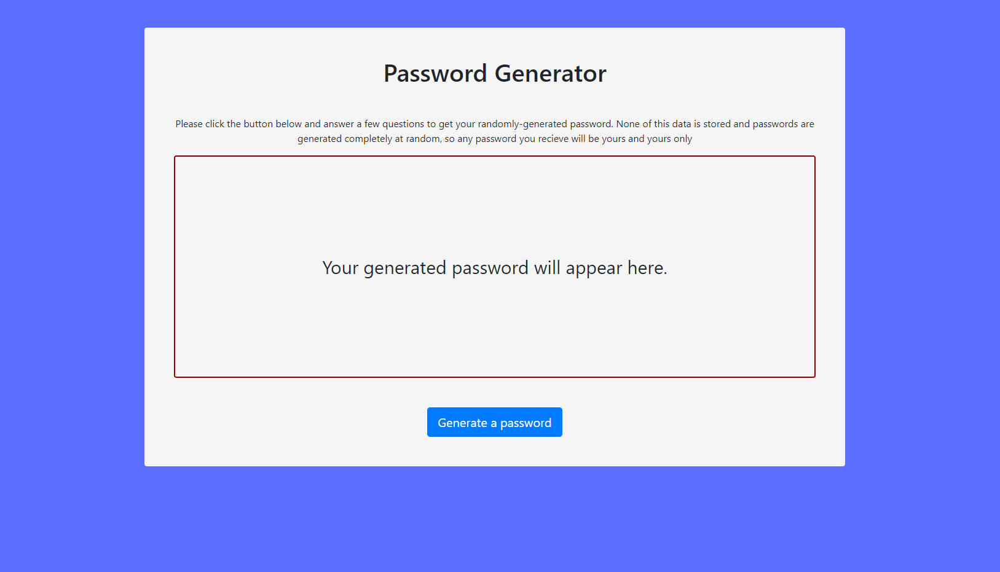
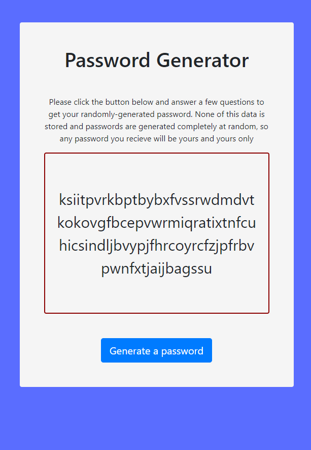

# password-generator
Random Password Generator

Description

*This is a random password generator made primary with javascript.

*HTML and CSS are minimal. The HTML exists purely for the user of the site to start the password generator and to receive the password.

*I have also added bootstrap, primarily to make the website responsive on different viewports. 

*The script primarily uses different arrays of characters. The confirm prompts assign  values of true/false, which determine whether the characters of an array are added to the main array the password is built from. Once all chosen character types are added to the main array, a loop uses the password's length (also determined by a prompt) to randomly select characters from the main array and push them into an array that carries the characters that will become the password. 

*The only difference is when both lowercase and uppercase letters are chosen. In this case, only the lowercase array is used, and a different loop runs to randomly capitalize letters in the password array. I decided to do this because having both the uppercase and lowercase alphabet in the possible characters array made it so that numbers and special characters would often not show up in the password, even when they were chosen by the user.

*after main loop is finished running and the password characters are all in their array, the array is joined together as one string and presented to the user on the webpage. 

*The process can be repeated multiple times with all different combinations without reloading. 

Links

Deployed app :
https://jjbidwell.github.io/password-generator/

Github repository: 
https://github.com/jjbidwell/password-generator/

Screenshots:

